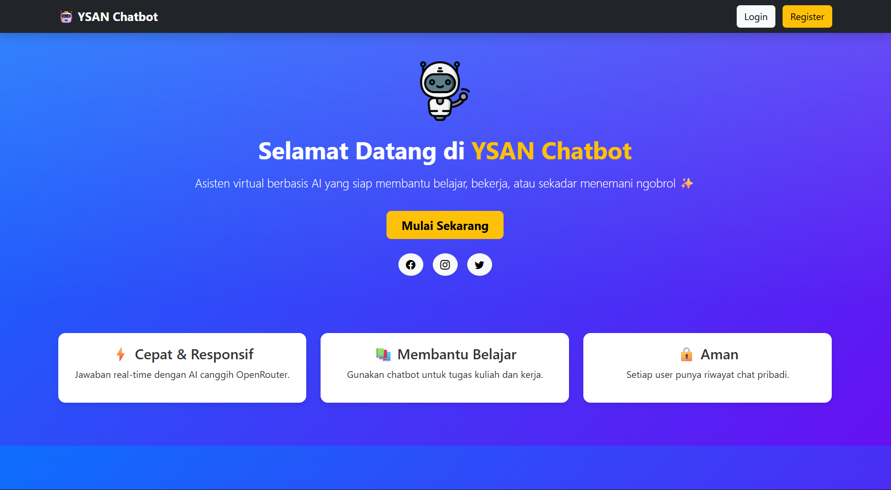
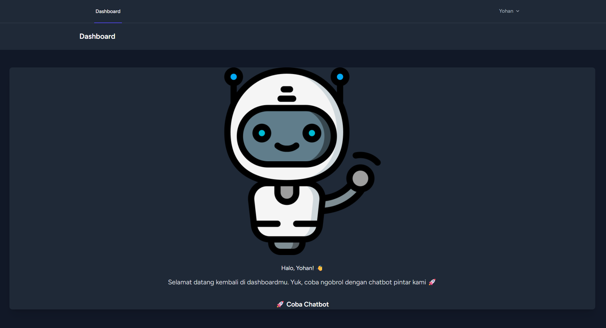
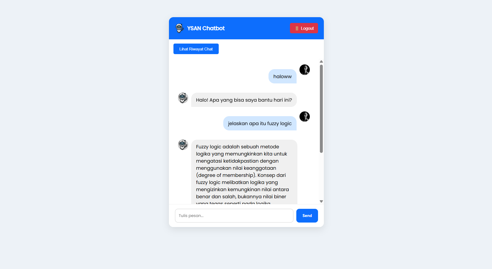

#  YSAN Chatbot

YSAN Chatbot adalah aplikasi chatbot berbasis web yang dibuat memakai **Laravel** dan terintegrasi dengan **OpenRouter API** (AI Model).  
Chatbot ini dapat digunakan untuk **belajar, membantu pekerjaan, atau sekadar ngobrol santai**.  
Setiap pengguna memiliki **akun login** dan **riwayat percakapan pribadi**.

---

## Fitur Utama

-   **Autentikasi Pengguna** (Register, Login, Logout)
-   **Halaman Welcome** yang modern dengan informasi sosial media
-   **Dashboard Personal** setelah login
-   **Chatbot AI** dengan tampilan interaktif
-   **Riwayat Chat** yang tersimpan di database
-   **UI Modern & Responsif** (Tailwind + custom CSS)

---

##  Tech Stack

-   **Backend**: Laravel 10+
-   **Frontend**: Blade, Tailwind CSS
-   **Database**: MySQL
-   **Authentication**: Laravel Breeze
-   **AI Integration**: [OpenRouter API](https://openrouter.ai/)

---

## Instalasi & Setup

1. **Clone repository**

    ```bash
    git clone https://github.com/Isan955/ysan-cbot.git
    cd ysan-cbot
    ```

2. **Install dependencies**

    ```bash
    composer install
    npm install
    npm run dev
    ```

3. **Konfigurasi `.env`**

    ```env
    APP_NAME="YSAN Chatbot"
    APP_URL=http://127.0.0.1:8000

    DB_CONNECTION=mysql
    DB_HOST=127.0.0.1
    DB_PORT=3306
    DB_DATABASE=db_chatbot
    DB_USERNAME=root
    DB_PASSWORD=

    OPENROUTER_API_KEY=your_api_key_here
    ```

4. **Migrasi Database**

    ```bash
    php artisan migrate
    ```

5. **Jalankan Server**

    ```bash
    php artisan serve
    ```

---

## 📸 Screenshots

-   **Welcome Screen**  
    

-   **Dashboard**  
    

-   **Chatbot**  
    

---

## Kontak

🌐 Website: [my-porto-pearl.vercel.app](https://my-porto-pearl.vercel.app/)  
📧 Email: contacthasanforbusiness@gmail.com  
📱 Instagram: [@hasannn.py](https://instagram.com/hasannn.py)
